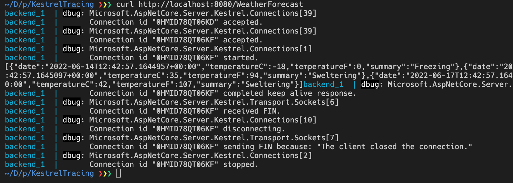

# enable Kestrel traces in Docker / Docker Compose

Add this:

        - Logging__LogLevel__Microsoft.AspNetCore.Server.Kestrel=Trace

To the `environment:` key in the [`compose.yml`](./compose.yaml) file.

Try it out with: 

    docker-compose up --build -d
    docker-compose logs -f &
    curl http://localhost:8080/WeatherForecast
    docker-compose stop

Cheers